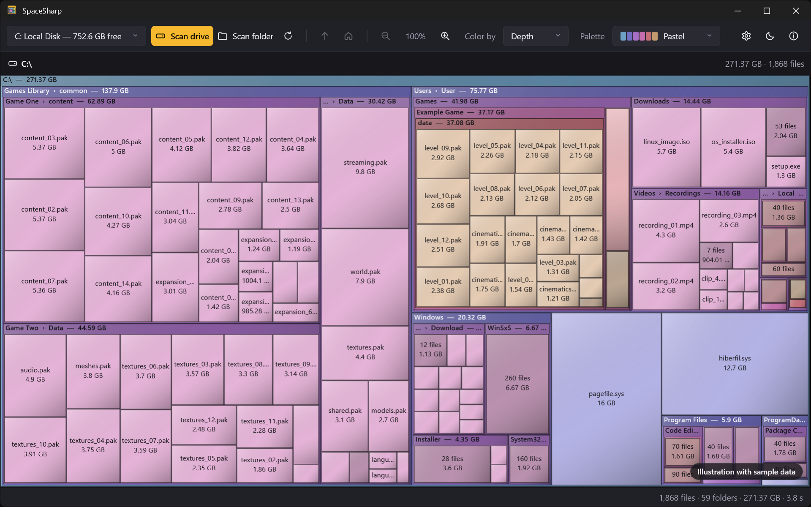

<p align="center">
  
</p>

<h1 align="center">SpaceSharp</h1>

<p align="center">
  See where your disk space went.<br>
  A fast, zoomable treemap of your drives for Windows, in the spirit of SpaceMonger.
</p>

<p align="center">
  <a href="LICENSE"></a>
  
  
</p>

<p align="center">
  <a href="https://github.com/ClearanceClarence/SpaceSharp/releases/latest/download/SpaceSharp.exe"></a>
</p>

<p align="center">
  
  <br>
  <sub>Illustration with sample data</sub>
</p>

---

SpaceSharp scans a drive or folder and draws every file and folder as a box whose area matches its size. Folders are boxes with a title bar, and their contents are laid out inside them, so the files and folders eating your space are obvious at a glance. Zoom into any folder, pan around, and send what you don't need to the Recycle Bin without leaving the map.

It's a single, portable `.exe` with no installer and no dependencies.

## Contents

- [Features](#features)
- [Download](#download)
- [Using SpaceSharp](#using-spacesharp)
- [Keyboard and mouse](#keyboard-and-mouse)
- [Building from source](#building-from-source)
- [Publishing an exe](#publishing-an-exe)
- [How it works](#how-it-works)
- [Project structure](#project-structure)
- [Customizing](#customizing)
- [Settings](#settings)
- [Known limitations](#known-limitations)
- [Ideas for the future](#ideas-for-the-future)
- [Credits](#credits)
- [License](#license)

## Features

**Scanning**
- Scan a whole drive or any folder, with live counts of files, folders and bytes while it runs
- Parallel scanning of the top folder levels, which is noticeably faster on SSDs
- Includes hidden and system files; skips junctions and symbolic links to avoid loops and double counting
- Folders that can't be read are flagged instead of stopping the scan, and a notice offers to restart as administrator
- Measures **file size** or **size on disk** (compressed size rounded to whole clusters), switchable at any time
- Optional hard-link detection so data with several names (like `WinSxS`) is counted once
- Cancel at any time with Esc

**The map**
- Squarified treemap layout, which keeps boxes close to square so sizes are easy to compare
- Nested folders with title bars showing name and size
- Chains of folders that only contain one folder (like `Users › adria › AppData › Local`) are merged into a single box with a combined title, instead of a stack of thin frames
- Folders with hundreds of small files (a photo shoot, a cache) show one "312 files" box instead of a grid of specks; zooming in reveals them individually
- Boxes too small to see are left out, so the map stays clean instead of turning into noise
- Cushion shading on every box (can be turned off), which makes sizes easier to compare than flat fills
- A gray "Free space" block when scanning a whole drive, so the map shows the entire disk

**Zoom and navigation**
- Double-click a folder and the view flies in until it fills the window
- Mouse-wheel zoom around the cursor, up to 1,000,000×, with crisp labels at every level
- Drag with the left or middle mouse button to pan
- Clickable breadcrumb path: click any folder in it to zoom there
- Up one folder, show the whole map, and zoom buttons in the toolbar

**Colors and themes**
- Color boxes by nesting depth or by file type (images, video, audio, archives, programs, documents, code)
- Eight palettes: Pastel, Retro, Ocean, Sunset, Forest, Neon, Monochrome and Color-blind safe
- Label text automatically switches between dark and light to stay readable on every color
- Light and dark themes, or follow the Windows setting and switch live when it changes
- Title bars follow the theme on Windows 10 and 11

**Cleaning up**
- Right-click any box to open it, show it in Explorer, copy its path, or move it to the Recycle Bin
- Deleting is undoable (it goes to the Recycle Bin) and the map updates without a rescan
- Rescan (F5) brings you back to the folder you were looking at

**Other**
- Status bar shows the full path, size, share of the current folder and file count for whatever is under the mouse
- About window with version, shortcuts and system info
- Per-monitor DPI aware and long-path aware
- Settings window with theme, palette, size measure, free space, shading, scanning and safety options, all remembered

## Download

Grab `SpaceSharp.exe` from the [Releases](../../releases) page. It runs on any 64-bit Windows 10 or 11 PC, including Windows on ARM through x64 emulation. Nothing needs to be installed.

> [!NOTE]
> The exe isn't code-signed, so Windows SmartScreen may show "Windows protected your PC" the first time you run it. Click **More info**, then **Run anyway**.

The first launch is a little slower than the ones after it, because the portable exe unpacks itself once.

## Using SpaceSharp

1. Pick a drive from the drop-down and click **Scan drive**, or click **Scan folder…** to choose a folder.
2. When the scan finishes, the whole drive or folder fills the window. The biggest boxes are the biggest space users.
3. Hover over a box to see its full path and size in the status bar.
4. Double-click a folder to zoom into it. Use Backspace, the mouse back button, the breadcrumb or the mouse wheel to zoom back out.
5. Right-click a file or folder to open it, find it in Explorer, or move it to the Recycle Bin.

To see protected system folders, run SpaceSharp as administrator. Otherwise those folders are skipped and marked as unreadable.

### Settings

The gear button in the toolbar (or Ctrl+,) opens the settings window. Every change applies immediately and is saved.

| Setting | What it does |
|---|---|
| **Theme** | Match Windows, Light or Dark. |
| **Palette** and **Color by** | The same choices as in the toolbar. |
| **Cushion shading** | Soft light-to-dark shading on each box. |
| **Size measure** | File size, or size on disk: the compressed size of compressed, sparse and cloud files, rounded up to whole clusters, like Explorer's "Size on disk". |
| **Show free space** | Adds a gray block for the drive's unused space when a whole drive is scanned. Off by default. |
| **Merge single-folder chains** | Draw folders that only contain one folder as a single box with a combined title. |
| **Group small items** | Replace children that would be smaller than about 30 × 22 px with a single "N files" box. |
| **Animate zoom** | Fly into folders instead of jumping. |
| **Include hidden and system files** | Off leaves out Hidden and System items such as `pagefile.sys`. Applies to the next scan. |
| **Count hard links once** | Reads every file's link count so data with several names (Windows keeps thousands in `WinSxS`) is counted once. Slower on big drives, off by default, applies to the next scan. |
| **Confirm before moving to the Recycle Bin** | Ask before deleting. |

**Reset to defaults** puts everything back. When folders couldn't be read, a notice appears under the toolbar with a **Restart as administrator** button; SpaceSharp restarts elevated and scans the same drive again.

### Color modes

| Mode | What the colors mean |
|---|---|
| **Depth** | Each nesting level gets its own color, like classic SpaceMonger. Files are a lighter shade of their folder's color. |
| **File type** | Files are colored by category (images, video, audio, archives, programs, documents, code, other) and folders are neutral gray. A legend appears next to the breadcrumb. |

### Palettes

| Palette | Look |
|---|---|
| Pastel | Soft colors, the default |
| Retro | Bright primaries, close to classic SpaceMonger |
| Ocean | Blues and teals |
| Sunset | Reds, oranges and plums |
| Forest | Greens and earth tones |
| Neon | Dark folders with bright neon files |
| Monochrome | Grays, with archives in amber in file-type mode |
| Color-blind safe | The Okabe-Ito palette, distinguishable with all common types of color blindness |

## Keyboard and mouse

| Input | Action |
|---|---|
| Double-click, Enter | Zoom the map to a folder (a file zooms to its folder) |
| Mouse wheel | Zoom in or out around the cursor |
| `+` / `−` | Zoom in or out around the center |
| Left or middle drag | Pan while zoomed in |
| Backspace, mouse back button | Up one folder |
| Home, Ctrl+0 | Show the whole map |
| F5 | Rescan |
| Ctrl+C | Copy the selected item's path |
| Ctrl+, | Settings |
| Del | Move the selected item to the Recycle Bin |
| C | Toggle cushion shading |
| G | Toggle grouping of small items |
| Esc | Cancel a scan |
| F1 | About |

## Building from source

**Requirements**
- Windows 10 or 11
- [.NET 10 SDK](https://dotnet.microsoft.com/download)
- JetBrains Rider, Visual Studio 2022 or later, or just the command line

**With Rider**
1. Open `SpaceSharp.sln`.
2. Press **Run** (Shift+F10).

**From the command line**, in the cloned repository:

```powershell
dotnet run --project .\SpaceSharp\SpaceSharp.csproj
```

The project has no NuGet dependencies; everything comes from .NET and WPF.

## Publishing an exe

Two publish profiles are included in `SpaceSharp/Properties/PublishProfiles`.

**Portable**: one exe with .NET built in. Runs on any 64-bit Windows 10/11 PC. About 30–40 MB.

```powershell
dotnet publish .\SpaceSharp\SpaceSharp.csproj -p:PublishProfile=Portable
```

**Small**: a much smaller exe that needs the [.NET 10 Desktop Runtime](https://dotnet.microsoft.com/download/dotnet/10.0) installed. If it's missing, Windows shows a download prompt.

```powershell
dotnet publish .\SpaceSharp\SpaceSharp.csproj -p:PublishProfile=Small
```

The exes are written to `publish\portable\` and `publish\small\`. In Rider, both profiles also show up as run configurations.

## How it works

**Scanning** (`Services/DiskScanner.cs`)
The scanner walks the folder tree on background threads with `DirectoryInfo.EnumerateFileSystemInfos`. The top three levels are scanned in parallel. Sizes are summed bottom-up, and each folder's children are sorted largest first, which the layout depends on. Progress counters are read by the UI a few times per second, so the scan never waits on the UI.

**Layout** (`Layout/Squarify.cs`)
Boxes are placed with the squarified treemap algorithm by Bruls, Huizing and van Wijk. Items are added to a row along the shorter side of the remaining space for as long as that improves the worst aspect ratio in the row, which produces boxes that are close to square.

**Rendering and zoom** (`Controls/TreemapControl.cs`)
The map is a custom WPF element that draws into `DrawingVisual`s instead of creating a control per box, so tens of thousands of boxes stay fast.

Zooming doesn't scale a picture. The map is laid out again on a virtual canvas that is the window size times the zoom level, shifted by the pan offset. Small files get real pixels and sharp labels as you zoom in, and only boxes that intersect the window are laid out and drawn, which keeps deep zoom fast.

Zooming to a folder is an animated camera move. It interpolates the zoom level logarithmically and moves the center so the camera appears to zoom toward a fixed point. Because title bars have a fixed pixel height, a folder's position shifts slightly with zoom, so the target is refined every frame and the view snaps to the exact framing at the end.

Hover and selection outlines live on a separate overlay, so moving the mouse doesn't redraw the map.

**Themes** (`Util/ThemeManager.cs`, `Themes/`)
All control styles are in `Styles.xaml` and reference colors through `DynamicResource`. Switching themes swaps `Dark.xaml` for `Light.xaml`, and every open window recolors immediately. In "Match Windows" mode, SpaceSharp reads the Windows app theme from the registry and listens for changes.

**Sizes** (`Services/NativeFileInfo.cs`)
Size on disk comes from `GetCompressedFileSizeW` for compressed, sparse, offline and cloud-placeholder files and from the plain length for everything else, rounded up to the volume's cluster size (`GetDiskFreeSpaceW`). Hard-link detection opens each file for attribute access only and reads its link count and file ID with `GetFileInformationByHandle`; a file whose ID was already seen is kept in the tree but contributes no size.

**Deleting** (`Services/RecycleBin.cs`)
Items are sent to the Recycle Bin through the Windows shell (`SHFileOperation` with undo enabled). Windows warns you if an item is too big for the Recycle Bin. After a successful delete, the node is removed from the tree and its size is subtracted from every parent.

## Project structure

```
SpaceSharp.sln
SpaceSharp/
├── App.xaml(.cs)                 startup, theme setup, error dialog
├── MainWindow.xaml(.cs)          main UI: toolbar, breadcrumb, map, status bar
├── AboutWindow.xaml(.cs)         About window
├── SettingsWindow.xaml(.cs)      settings window
├── Controls/
│   └── TreemapControl.cs         map rendering, zoom camera, hit testing, input
├── Layout/
│   └── Squarify.cs               squarified treemap algorithm
├── Models/
│   └── FsNode.cs                 file/folder tree
├── Services/
│   ├── DiskScanner.cs            background scanner with progress, size on disk, hard links
│   ├── NativeFileInfo.cs         Win32 calls for cluster size, compressed size and file IDs
│   └── RecycleBin.cs             undoable delete through the Windows shell
├── Util/
│   ├── Palette.cs                color palettes and file-type categories
│   ├── ThemeManager.cs           light/dark switching
│   ├── TitleBarTheme.cs          light/dark window title bars
│   ├── AppSettings.cs            saved preferences
│   └── SizeFormatter.cs          "1.23 GB" formatting
├── Themes/
│   ├── Styles.xaml               control styles (buttons, drop-downs, menus, tooltips)
│   ├── Dark.xaml                 dark theme colors
│   └── Light.xaml                light theme colors
├── Assets/
│   ├── SpaceSharp.svg            icon source
│   ├── SpaceSharp-small.svg      simplified icon for 16–24 px
│   ├── SpaceSharp.ico            icon with all Windows sizes (16–256 px)
│   └── SpaceSharp-256.png        icon used in the app UI
├── Properties/PublishProfiles/   Portable and Small publish profiles
├── app.manifest                  DPI and long-path awareness
└── SpaceSharp.csproj
```

## Customizing

**Add a palette**
Add an entry to `BuildSchemes()` in `Util/Palette.cs`. The simplest form is a name and a list of folder colors; file colors and file-type colors are derived from them:

```csharp
FromList("Lavender",
    new[] { "#7B6FD6", "#9A8FE0", "#B7A8E8", "#6C8FD6", "#A58CC9", "#8D7BB8", "#C6A0D8" }, 0.5),
```

You can also pass your own file-type colors as a third argument, one per category in the order of the `FileCategory` enum.

**Change theme colors**
Edit the hex values in `Themes/Dark.xaml` or `Themes/Light.xaml`. Both files must define the same keys.

**Add file types**
Extensions and their categories are listed in `BuildExtensionMap()` in `Util/Palette.cs`.

**Name, version and author**
These come from `SpaceSharp.csproj` (`Version`, `Authors`, `Copyright`, `Description`) and appear in the About window and in the exe's file properties.

**Icon**
Edit `Assets/SpaceSharp.svg`, and `Assets/SpaceSharp-small.svg` for the tiny sizes. Then rebuild `SpaceSharp.ico` with any tool that makes multi-size icons: use the small SVG for the 16, 20 and 24 px frames and the main SVG for 32, 40, 48, 64, 128 and 256 px. Also update `SpaceSharp-256.png`, which the app uses in its own UI.

## Settings

Your palette, color mode and theme are saved to:

```
%AppData%\SpaceSharp\settings.json
```

Delete the file to go back to the defaults.

## Known limitations

- **Windows only.** SpaceSharp is built on WPF.
- **Size on disk is an estimate** for files stored inside the MFT (very small files) and for alternate data streams, which aren't counted.
- **Hard links** are counted once per name unless "Count hard links once" is on, so `C:\Windows\WinSxS` can look bigger than it is by default.
- **Links aren't followed.** Junctions and symbolic links to folders are skipped on purpose; the target is counted where it really lives.
- **Protected folders** need administrator rights to be read.
- **Cloud placeholders.** In file-size mode, online-only OneDrive files show their full size. Switch to size on disk to see the local footprint.

## Ideas for the future

- Filtering and highlighting by name, file type, size or age
- Top lists: largest files, largest folders, space by file type
- Saving scans so reopening the app is instant
- Exporting the scan as CSV

## Credits

- Squarified treemap layout: Mark Bruls, Kees Huizing and Jarke J. van Wijk, *Squarified Treemaps* (2000)
- Inspired by [SpaceMonger](https://en.wikipedia.org/wiki/SpaceMonger)
- Interface icons: Segoe Fluent Icons / Segoe MDL2 Assets, built into Windows
- Color-blind safe palette: Masataka Okabe and Kei Ito

## License

SpaceSharp is released under the [MIT License](LICENSE). You're free to use, modify and share it, including in commercial projects, as long as the copyright notice is kept.

Made by ClearanceClarence.

## Changelog

### 1.1.0
- Size on disk as an alternative measure
- Optional hard-link detection
- Free-space block for whole-drive scans, updated when you delete files
- Notice for protected folders with one-click restart as administrator
- Cushion shading
- Small items grouped into one "N files" box instead of grids of tiny boxes
- Settings window (Ctrl+,) with all options, including new ones: merge single-folder chains, animate zoom, include hidden files, confirm before delete

### 1.0.0
- First release
